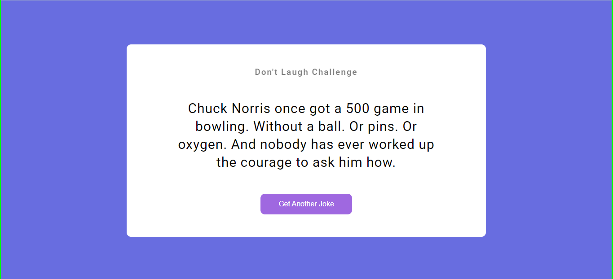

# Assignment 2

## Project 06 [Live Link](https://nachiketkeripaleproject15.netlify.app/)

- Build this project from strach.
- Understood how we can handle API.
- Understood use of async and await.
- Used fetch function.
---

[Github Link](https://github.com/nachiketkeripale/JSJokesGenerator)

## Time taken to finish this project

-   1 hour to complete it.

#### Screenshot

 

